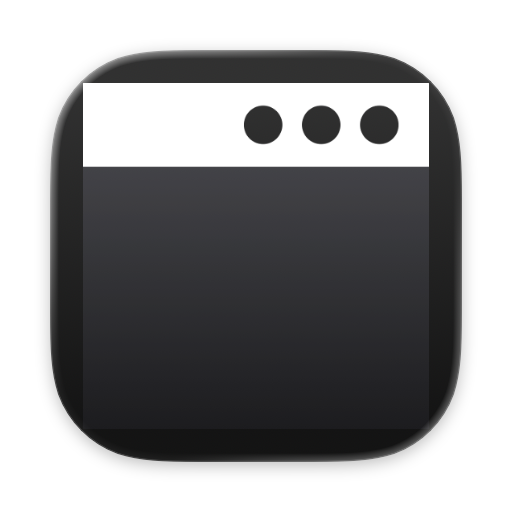
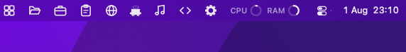
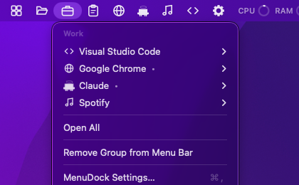
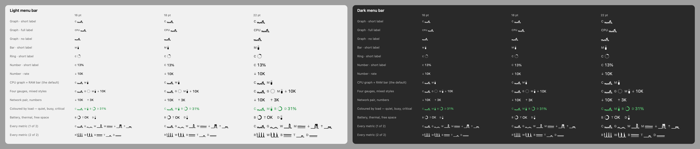
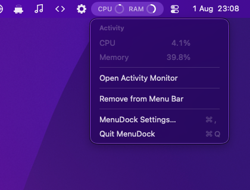
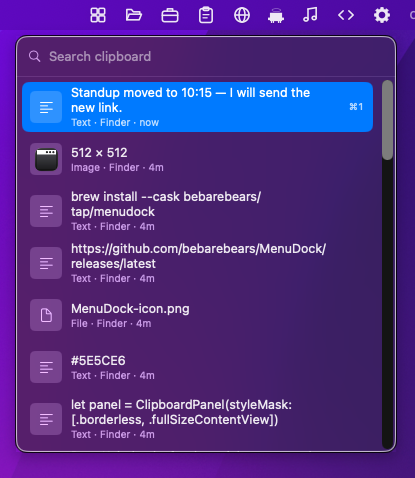
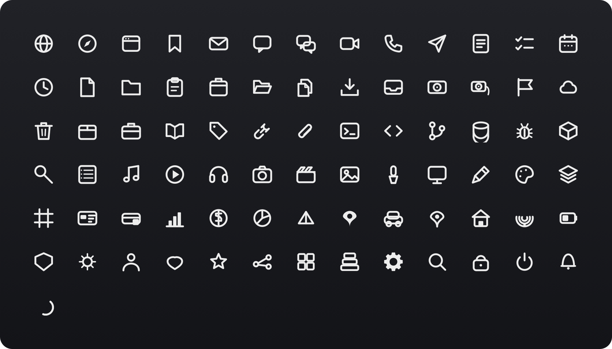
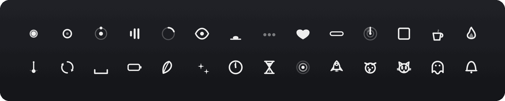
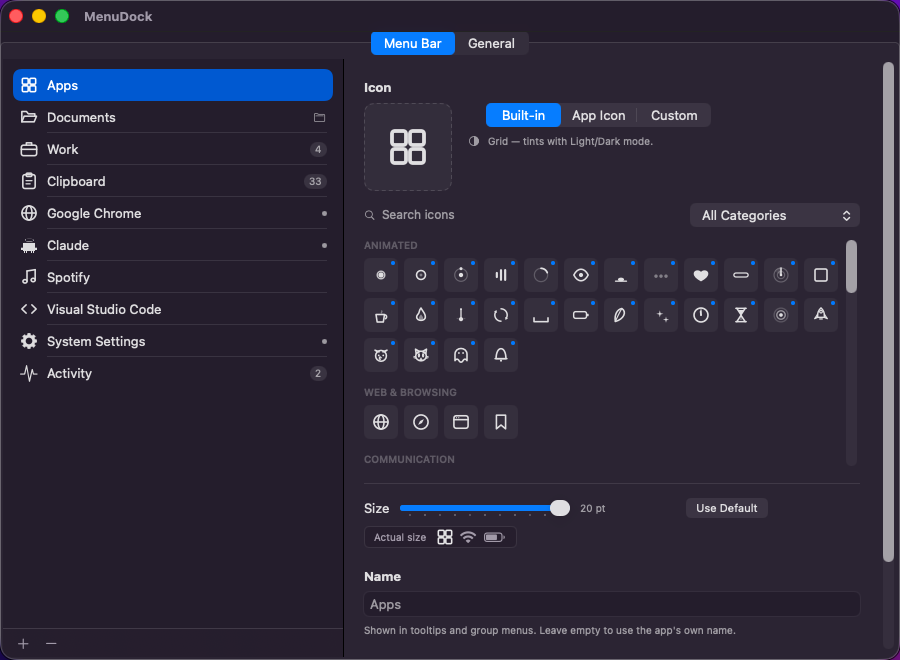
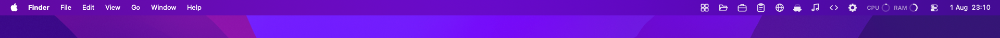

<div align="center">



# MenuDock

**Your Dock, in the menu bar.**

Apps, folders, groups, live system metrics and your clipboard history —
each one icon, each one click, none of them a Dock.

[](https://github.com/bebarebears/MenuDock/releases/latest)
[](https://github.com/bebarebears/MenuDock/releases/latest)
[](LICENSE)

<br>



<sub>Apps · a folder · a group · the clipboard · a live CPU and memory readout.</sub>

</div>

---

## Install

```bash
brew install --cask --no-quarantine bebarebears/tap/menudock
```

Or download `MenuDock.dmg` from the [latest release](https://github.com/bebarebears/MenuDock/releases/latest)
and drag it to Applications.

MenuDock has no Dock icon and no window at startup, so after launching, **look in your menu bar**.
Click the MenuDock icon, choose *Settings…*, and press **+**.

**Requirements:** macOS 14 Sonoma or later. Apple Silicon or Intel.

<details>
<summary><b>“Apple could not verify MenuDock”</b> — only if you used the DMG</summary>

<br>

MenuDock is free and open source and is not signed with a $99/year Apple Developer certificate, so
macOS cannot check who built it. Every release is built from the source in this repository.

1. Double-click MenuDock, then click **Done** on the warning.
2. Open **System Settings › Privacy & Security**.
3. Scroll to *“MenuDock was blocked to protect your Mac”* and click **Open Anyway**.

Once, and never again. Or, in one command:

```bash
xattr -dr com.apple.quarantine /Applications/MenuDock.app
```

Homebrew's `--no-quarantine` avoids all of this.

</details>

---

## Five things to put up there

### Apps

Click to launch. Click again to bring it forward — or to restore a window if it is running with
none, exactly like a real Dock tile. A dot marks what is running, and right-click gives you hide,
quit and new window.

### Folders

Point an item at a folder and a click opens it in Finder. Give one item several folders and it
offers them as a menu — or opens all of them at once, if that is how you start your day.

### Groups

Several apps behind a single icon, as a dropdown. One slot in the bar, one context of work.

<div align="center">
  
</div>

### Activity

A live readout of your machine: **CPU, GPU, power in watts, memory, network up and down, disk read
and write.** Put as many metrics as you like behind one icon, draw each as a **graph, bar, ring or
number**, and caption it with nothing, a letter or a word. The item sizes itself — you never set a
width.

<div align="center">
  
  <br>
  <sub>Every style, at 16 / 18 / 22 pt, Light and Dark. Template images, so they take the bar's own tint.</sub>
</div>

Click it and every reading appears in full — `11.9 MB/s`, not the four characters that fit up
there — and keeps updating while the menu is open.

<div align="center">
  
</div>

**It costs almost nothing.** Every counter is read straight from the kernel — nothing shells out to
`top` or `ioreg` — and only the metrics you actually display are sampled, so a CPU-only item never
touches the GPU or the network. Measured on an M5, Release build, once a second:

| Setup | CPU |
|---|---|
| No Activity item | 0.008% of one core |
| One item, CPU graph + memory bar | **0.18%** |
| Two items, 8 gauges across 6 metrics | **0.38%** |

Sampling stops completely behind a fullscreen app, on a locked or sleeping screen, and on a
switched-away session — and the interval doubles in Low Power Mode.

<details>
<summary>About the watts</summary>

<br>

It is **SoC package power** — CPU + GPU + Neural Engine — read from the energy accumulators Apple
Silicon publishes through IOReport, the same counters `powermetrics` reports. A measurement off the
chip's own power-management hardware, not an estimate from CPU usage. It is *not* wall power: the
display, SSD, Wi-Fi and anything on USB are excluded, so it reads lower than a socket meter. On an
M5 Air, roughly 1–2 W idle and 20–26 W with every core busy.

Why not something more complete? `powermetrics` refuses to run without root, battery current reads
**zero whenever you are plugged in**, and `AdapterDetails.Watts` is the charger's rating rather than
its draw. Package power is the honest ceiling on what any unprivileged app can measure — and it is
the part that moves when your work does.

</details>

### Clipboard

Everything you copy — text, images, files — kept and handed back. Click the icon or press **⌘⇧V**
anywhere and the history drops from it: search it, arrow through it, press Return. Or never look at
all: **hold ⌘⇧ and tap V** to walk down the list, then let go to paste what you landed on, exactly
the way ⌘-Tab works.

<div align="center">
  
</div>

**You choose what it keeps.** An hour, a day, a week, 30 days, or until you clear it — plus a
ceiling on how many items. Turn text, images or files off individually, or all three to pause
recording without losing what you have.

**Copied files are recorded by path, never duplicated,** so putting a 4 GB video on the clipboard
costs the length of its filename. Images are stored once as PNG, with a small thumbnail for the row.

**On privacy.** Password managers flag what they copy with the standard `ConcealedType` marker and
MenuDock skips those by default, as it does anything an app marks transient. Nothing is recorded at
all unless a Clipboard item is in your menu bar — no item, no polling, no history, which is a claim
you can check by removing it. Everything stays on your Mac in
`~/Library/Application Support/MenuDock/Clipboard`, and *Clear History* deletes the bytes.

**One permission, for one keystroke.** Opening the history, searching it, cycling it and copying
from it need no permission whatsoever. Only *pasting for you* — pressing ⌘V in another app on your
behalf — needs Accessibility, because macOS lets no app synthesise keystrokes without it. Without
it, choosing an item copies it and returns you to your app; you press ⌘V. One keypress, not the
feature.

> **If auto-paste stops working after an update,** the permission has gone stale rather than been
> revoked. macOS ties an Accessibility grant to the exact copy of the app it was given to, and
> MenuDock has no Developer ID, so a new version is a different app as far as the permission is
> concerned — the switch in **Privacy & Security › Accessibility** still reads as on while the grant
> no longer applies. Switch it off and on again, or remove MenuDock with **–** and add it back with
> **+**. MenuDock says so itself the first time a paste is refused.

---

## 107 icons, drawn rather than shipped

Every glyph is **drawn in code** on a 24 × 24 grid: pixel-exact at any menu bar height, a few
hundred bytes each, and tinted for Light and Dark automatically.

<div align="center">
  
  <br>
  <sub>79 static glyphs, across 12 categories.</sub>
</div>

Another 28 are **gently animated** — and gently is the point. Periods run 2.2–4.5 seconds, eased
rather than linear, small amplitude or pure opacity. A menu bar sits in your peripheral vision all
day; anything sharp there reads as an alert.

<div align="center">
  
  <br>
  <sub>28 animated glyphs. Four — the dog, the cat, the ghost, the bell — also react when clicked.</sub>
</div>

Prefer your own? Point any item at an SF Symbol, a PNG, or an SVG that stays vector all the way to
the screen.

---

## Everything is per item

<div align="center">
  
</div>

Pick an icon source, override the size for that one item, rename it, reorder by dragging — the menu
bar follows the list. The size control previews at **true size** against real system items, because
16 pt and 19 pt are indistinguishable in a large preview well.

Apps, folders and groups can be added as often as you like. **Activity and Clipboard are one each** —
a second of either would sample the same counters or watch the same pasteboard twice — so the **+**
menu shows them ticked off once you have one.

<div align="center">
  
  <br>
  <sub>They sit among the system items and behave like they belong there — template images, so they
  take the bar's own tint.</sub>
</div>

**It stays out of the way.** Animation is suppressed entirely under Reduce Motion, pauses when your
screen sleeps or locks, and halves its frame rate in Low Power Mode. Steady-state CPU is under 1%,
and turning animation off costs exactly 0.0%.

Your setup lives in `~/Library/Application Support/MenuDock/`. Custom icons are **copied** in, so
clearing out `~/Downloads` never breaks your menu bar.

---

## Uninstall

```bash
brew uninstall --cask menudock
```

Or drag `/Applications/MenuDock.app` to the Trash. Either way your settings stay in
`~/Library/Application Support/MenuDock/`; delete that folder to remove them too.

---

## Build from source

Requires Xcode 15+ and [XcodeGen](https://github.com/yonaskolb/XcodeGen):

```bash
brew install xcodegen
git clone https://github.com/bebarebears/MenuDock.git
cd MenuDock
make run
```

| Command | What it does |
|---|---|
| `make run` | Build (Debug) and launch from `.build` |
| `make install` | Build and install into `/Applications` |
| `make dmg` | Build a universal Release `.dmg` into `dist/` |
| `make project` | Regenerate `MenuDock.xcodeproj` after adding or removing files |
| `make signing-identity` | Create a stable self-signed certificate, so rebuilds stop revoking Accessibility |
| `make icon` | Redraw `Resources/AppIcon.icns` |
| `make showcase` | Redraw the icon sheets and GIF in `docs/images/` |
| `make logs` | Tail the app's `os_log` output |
| `make stop` | Quit MenuDock |

`MenuDock.xcodeproj` and `Resources/AppIcon.icns` are both generated and git-ignored — run
`make project` after adding or removing source files.

---

## Contributing & internals

Issues and pull requests are welcome — see [CONTRIBUTING.md](CONTRIBUTING.md).

MenuDock is Swift 6, AppKit for the menu bar and SwiftUI for settings, with no third-party
dependencies. [**docs/ARCHITECTURE.md**](docs/ARCHITECTURE.md) is a long-form write-up of the design
decisions behind it — why the menu bar is AppKit rather than `MenuBarExtra`, how the status-item
ordering constraint works, why icons are drawn in code, and the profiling that took animated icons
from 7.5% CPU to 0.6%. Worth reading before a non-trivial PR.

## License

MIT — see [LICENSE](LICENSE).
